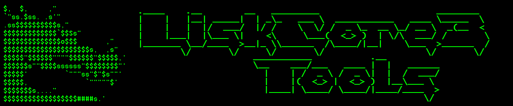

# Download & Import Latest Snapshot

## Automated Script

**Requirement**: Manage lisk-core process with PM2. (PM2 Commands Inside!)

Install
```shell
# Mainnet
curl -s https://raw.githubusercontent.com/Gr33nDrag0n69/LiskCore3Tools/main/SH/lisk-rebuild.main.sh -o ~/lisk-rebuild.sh && chmod 700 ~/lisk-rebuild.sh

#TestNet
curl -s https://raw.githubusercontent.com/Gr33nDrag0n69/LiskCore3Tools/main/SH/lisk-rebuild.test.sh -o ~/lisk-rebuild.sh && chmod 700 ~/lisk-rebuild.sh
```

Use
```shell
~/lisk-rebuild.sh
```

## Manual Steps

Stop Lisk-Core

Rebuild Blockchain
```shell
# Download snapshot files:

# LiskNode.io:

## MainNet
lisk-core blockchain:download --url https://snapshot.lisknode.io/blockchain.db.tar.gz --output ~/

## TestNet
lisk-core blockchain:download --url https://testnet3-snapshot.lisknode.io/blockchain.db.tar.gz --output ~/

# Import to DB:
lisk-core blockchain:import ~/blockchain.db.tar.gz --force

# Delete downloaded files:
rm -f ~/blockchain.db.tar.gz
rm -f ~/blockchain.db.tar.gz.SHA256
```

Start Lisk-Core
