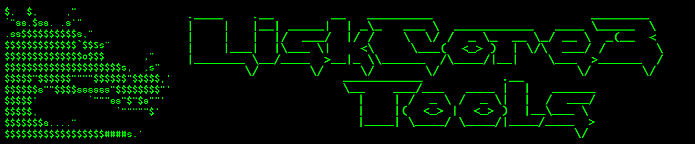

Misc. stuff related to lisk-core 3 network.

- [MainNet](#mainnet)
  - [Explorer](#explorer)
  - [Lisk-Service](#lisk-service)
  - [Snapshot](#snapshot)
  - [HTTP Legacy API](#http-legacy-api)
  - [WS (WebSocket) API](#ws-websocket-api)
  - [Scripts](#scripts)
    - [Bash](#bash)
  - [Others](#others)

# MainNet

## Explorer

* moosty - [Lisk Scan](https://liskscan.com/)
* carbonara - [Lisk Observer](https://lisk.observer/)

## Lisk-Service

To use with [Lisk Desktop](https://github.com/LiskHQ/lisk-desktop/releases) software or as the **modern API** endpoint. Copy the address to use it as a base URL or click the link to view the current status of the endpoint.

**Documentation: [Lisk Service API](https://lisk.com/documentation/lisk-service/references/api.html)**

* lisk.io - [https://service.lisk.io](https://service.lisk.io/api/status)
* lemii - [https://mainnet-service.lisktools.eu](https://mainnet-service.lisktools.eu/api/status)
* punkrock - [https://lisk-mainnet-service.punkrock.me](https://lisk-mainnet-service.punkrock.me/api/status)
* corsaro - [https://lisk-mainnet-service.liskworld.info ](https://lisk-mainnet-service.liskworld.info/api/status)
* stellardynamic - [https://service.liskapi.io](https://service.liskapi.io/api/status)

## Snapshot

Rebuild a lisk-core database from a blockchain snapshot (hourly automated backup)

**Guide:** [Rebuild Blockchain From Snapshot](https://github.com/Gr33nDrag0n69/LiskCore3Tools/blob/main/MD/RebuildBlockchainFromSnapshot.md)

* gr33ndrag0n - [snapshot.lisknode.io](https://snapshot.lisknode.io/)

## HTTP Legacy API

Copy the address to use it as a base URL or click the link to view the current node info.

**Documentation: [Lisk Core v3 API](https://lisk.io/documentation/lisk-core/v3/reference/api.html)**

* gr33ndrag0n - [https://api.lisknode.io](https://api.lisknode.io/api/node/info)
* lemii - [https://mainnet-api.lisktools.eu](https://mainnet-api.lisktools.eu/api/node/info)
* punkrock - [https://lisk-mainnet-api.punkrock.me](https://lisk-mainnet-api.punkrock.me/api/node/info)

## WS (WebSocket) API

Copy the address to use it as a base URL or use this helper tool I built to explore it: [Lisk WebSocket Explorer](https://wsexplorer.lisknode.io/)

**Documentation: [WebSocket JSON 2.0 RPC API](https://lisk.com/documentation/lisk-service/references/rpc-api.html)**

* gr33ndrag0n - wss://api.lisknode.io/ws
* lemii - wss://mainnet-api.lisktools.eu/ws
* punkrock - wss://lisk-mainnet-api.punkrock.me/ws

## Scripts

### Bash

* [Enable Delegate Forging](https://raw.githubusercontent.com/Gr33nDrag0n69/LiskCore3Tools/main/SH/lisk-forging-enable.sh)
* [Disable Delegate Forging](https://raw.githubusercontent.com/Gr33nDrag0n69/LiskCore3Tools/main/SH/lisk-forging-disable.sh)
* [Create Snapshot](https://raw.githubusercontent.com/Gr33nDrag0n69/LiskCore3Tools/main/SH/lisk-create-snapshot.sh)
* [Rebuild From Snapshot](https://raw.githubusercontent.com/Gr33nDrag0n69/LiskCore3Tools/main/SH/lisk-rebuild.main.sh)

## Others

* stellardynamic - [sidechainsolutions.io](https://sidechainsolutions.io/)
